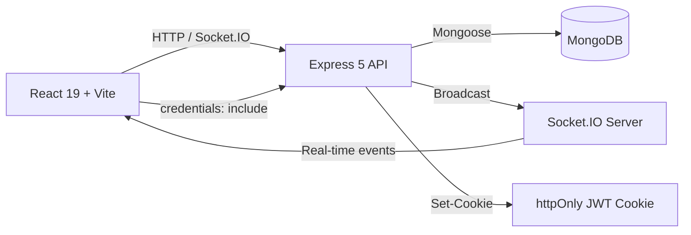
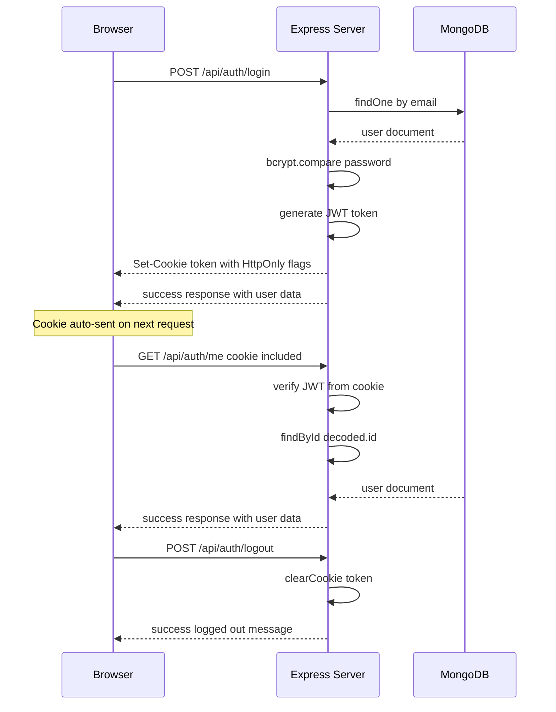
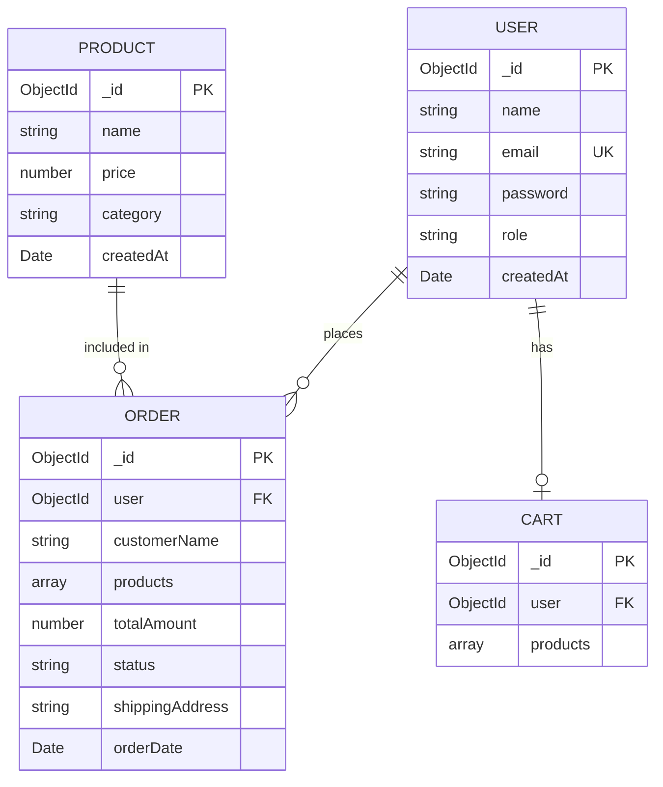
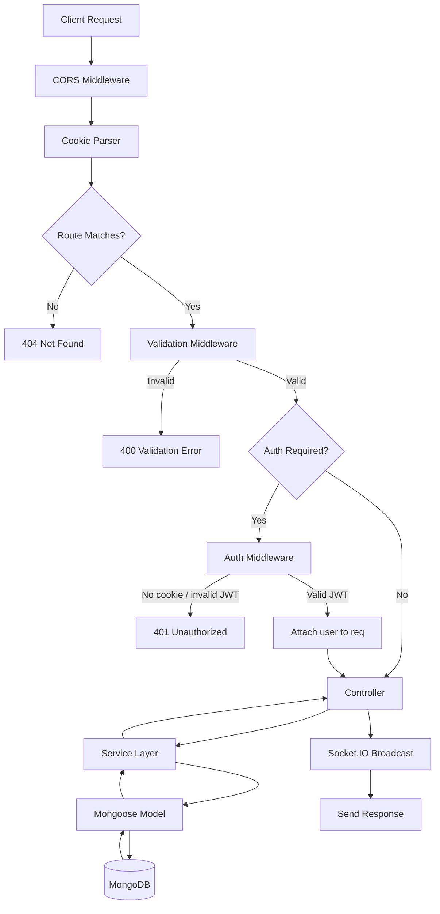

# Botit - Full Stack E-Commerce Platform

A full-stack e-commerce application with a customer storefront and admin dashboard, built with React + Express + MongoDB + Socket.IO for real-time updates.

## Features

### Customer Storefront
- Browse products with search and category filtering
- Product detail pages
- Shopping cart (add, update quantity, remove)
- Checkout with shipping info
- View order history

### Admin Dashboard
- Dashboard with live stats (products, orders, revenue)
- Product management (create, edit, delete)
- Order management with filtering (by date range, price range)
- Order status tracking (pending, confirmed, shipped, delivered)
- Real-time updates via Socket.IO

## Tech Stack

### Frontend
- **React 19** + **Vite 8**
- **Tailwind CSS v4** + **shadcn/ui** components
- **React Router v7** for routing
- **Socket.IO Client** for real-time updates
- Custom warm beige/charcoal color theme

### Backend
- **Express 5** + **Node.js**
- **MongoDB** + **Mongoose** for database
- **Socket.IO** for real-time event broadcasting
- **JWT** authentication via httpOnly cookies (1h expiry)
- **Joi** for request validation
- **bcrypt** for password hashing
- **Helmet** + **CORS** + **Rate Limiting** for security

## Architecture

### System Architecture



### Authentication Flow



### Database Schema



### API Request Lifecycle



## Setup

### Prerequisites
- Node.js 18+
- MongoDB instance (local or Atlas)

### Backend

```bash
cd backend
npm install
```

Create a `.env` file:

```
PORT=3000
DB_URI=mongodb://localhost:27017/botit
SECRET_JWT=your_jwt_secret
```

Start the server:

```bash
npm run dev
```

The API runs at `http://localhost:3000/api`.

### Frontend

```bash
cd frontend
npm install
npm run dev
```

The app runs at `http://localhost:5173`.

## API Endpoints

| Method | Endpoint | Auth | Description |
|--------|----------|------|-------------|
| POST | `/api/auth/register` | No | Register new user (sets httpOnly cookie) |
| POST | `/api/auth/login` | No | Login (sets httpOnly cookie) |
| GET | `/api/auth/me` | Yes (cookie) | Get current user profile |
| POST | `/api/auth/logout` | No | Logout (clears cookie) |
| GET | `/api/products` | No | List all products |
| GET | `/api/products/:id` | No | Get product by ID |
| POST | `/api/products` | Admin | Create product |
| PUT | `/api/products/:id` | Admin | Update product |
| DELETE | `/api/products/:id` | Admin | Delete product |
| GET | `/api/orders` | Admin | List all orders (filterable) |
| GET | `/api/orders/user` | Yes | Get user's orders |
| POST | `/api/orders/checkout` | Yes | Checkout from cart |
| PUT | `/api/orders/:id` | Admin | Update order status |
| DELETE | `/api/orders/:id` | Admin | Delete order |
| GET | `/api/cart` | Yes | Get user cart |
| POST | `/api/cart` | Yes | Add item to cart |
| PUT | `/api/cart/:productId` | Yes | Update cart item quantity |
| DELETE | `/api/cart/:productId` | Yes | Remove item from cart |

## Authentication: Why httpOnly Cookies?

This project uses **httpOnly cookies** instead of localStorage for JWT token storage. Here's why:

### The Problem with localStorage

Storing JWTs in `localStorage` is a common anti-pattern in production applications:

- **XSS Vulnerability**: Any JavaScript running on the page (including malicious scripts injected via XSS) can read `localStorage` and steal the token with `localStorage.getItem("token")`.
- **No Expiration Control**: localStorage persists indefinitely. Even after logout, stale tokens may remain.
- **Manual Token Management**: The frontend must manually attach the token to every request via `Authorization` headers, increasing the chance of bugs.

### Why httpOnly Cookies Are Better

- **XSS Protection**: The `httpOnly` flag means JavaScript **cannot access the cookie at all** — not via `document.cookie`, not via any client-side code. Even if an XSS attack occurs, the attacker cannot steal the JWT.
- **Automatic Inclusion**: The browser automatically sends the cookie with every request to the server — no manual `Authorization` header needed.
- **sameSite Protection**: Setting `sameSite: "lax"` provides built-in CSRF protection — the cookie is only sent on top-level navigation and same-origin requests.
- **Secure Flag**: In production (HTTPS), the `secure` flag ensures the cookie is only sent over encrypted connections.
- **Server-Side Control**: The server controls creation (`Set-Cookie`) and deletion (`Clear-Cookie`). The client never touches the token directly.

### How It Works in This Project

```
1. User logs in (POST /api/auth/login)
   → Server validates credentials
   → Server sets httpOnly cookie: Set-Cookie: token=eyJ...; HttpOnly; SameSite=Lax; Path=/
   → Server returns user data (no token in response body)

2. User makes authenticated requests
   → Browser automatically sends cookie with every fetch (credentials: "include")
   → Server reads token from req.cookies.token
   → No Authorization header needed

3. User refreshes the page
   → Frontend calls GET /api/auth/me on mount
   → Cookie is auto-sent, server verifies and returns user data
   → Session is restored without localStorage

4. User logs out (POST /api/auth/logout)
   → Server clears the cookie: Set-Cookie: token=; Max-Age=0
   → Session is destroyed
```

### Testing with Postman

After logging in, Postman automatically saves cookies from the `Set-Cookie` header. Subsequent requests to the same domain will include the saved cookie — no need to manually paste tokens.

## Socket.IO Events

The server broadcasts these events for real-time updates:

| Event | Payload | Description |
|-------|---------|-------------|
| `productCreated` | Product object | New product added |
| `productUpdated` | Product object | Product edited |
| `productDeleted` | `{ id }` | Product removed |
| `orderCreated` | Order object | New order placed |
| `orderUpdated` | Order object | Order status changed |
| `orderDeleted` | `{ id }` | Order removed |

## Project Structure

```
fullstack-order-dashboard/
├── backend/
│   ├── src/
│   │   ├── DB/models/          # Mongoose models
│   │   ├── Modules/
│   │   │   ├── auth/           # Registration, login, profile, logout
│   │   │   ├── cart/           # Cart CRUD
│   │   │   ├── order/          # Orders + checkout
│   │   │   └── product/        # Product CRUD
│   │   ├── Middlewares/        # Auth (cookie-based), validation, rate limit
│   │   └── utils/              # Error handling, hashing, tokens
│   └── index.js
├── frontend/
│   ├── src/
│   │   ├── components/
│   │   │   ├── layout/         # Navbar, Footer, AdminLayout
│   │   │   ├── ui/             # shadcn components
│   │   │   └── app-sidebar.jsx # Admin sidebar
│   │   ├── contexts/           # AuthContext, CartContext
│   │   ├── hooks/              # Custom hooks (useSocket)
│   │   ├── lib/                # API client (credentials: include), socket client
│   │   └── pages/              # All pages
│   │       ├── admin/          # Dashboard, Products, Orders
│   │       ├── Products, ProductDetail
│   │       ├── Cart, Checkout
│   │       ├── Login, Register
│   │       └── Orders
│   └── index.css               # Custom theme
```

## Notes

- User roles: `admin` and `user` (default)
- Admin routes are protected with both authentication and authorization middleware
- Products browsing is public; cart and checkout require login
- Real-time updates automatically refresh admin pages when data changes
- Sidebar state persists across page reloads via cookie
- Auth token is stored as an httpOnly cookie — never accessible via JavaScript
